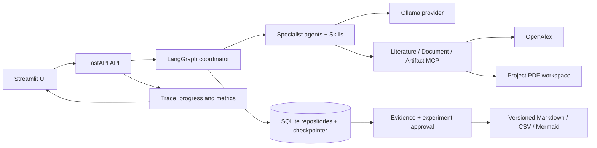

# ResearchPilot Architecture

The API is the only UI boundary. Domain services use typed Pydantic contracts, repositories own SQLite access, and MCP adapters isolate external tools. Each long-running search item is persisted independently; LangGraph checkpoints and approval versions make restart/resume deterministic. PDF and artifact paths are project-relative and are revalidated before access.

An incoming `X-Request-ID` is propagated through API middleware, Graph configuration, MCP calls and OpenAlex headers. Trace payloads deliberately exclude prompts and secrets.

## Release boundaries

- One local Ollama model is configured at a time; quality and latency depend on its exact tag and digest.
- OpenAlex online evaluation needs a valid key and network access. The default 20-item release suite is offline and deterministic.
- PDF extraction uses PyMuPDF heuristics; scanned PDFs and complex tables may need OCR/layout tooling outside this release.
- SQLite targets a single-machine deployment, not a multi-writer distributed service.
