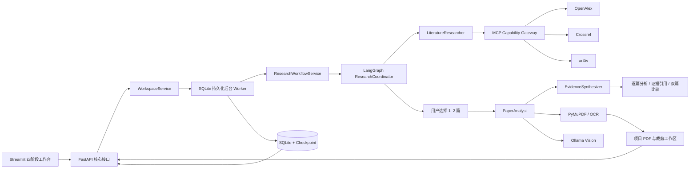

# ResearchPilot Architecture

## HTTP 边界

Streamlit 只依赖以下 7 种路径（9 个操作）：`/health`、`/projects`（GET/POST）、`/projects/{id}`（PATCH/DELETE）、`/projects/{id}/workspace`、`/projects/{id}/actions`、`/projects/{id}/documents` 和 `/projects/{id}/resources/{token}`。API 另暴露 `GET /mcp/status` 作为第 8 种路径（第 10 个操作），供 MCP 能力注册与健康诊断，工作台不使用。

统一 workspace 是轻量读模型；传入不透明论文令牌时才附加论文摘要、Figure Cards、Structured Tables 与轻量证据。项目状态的推进统一进入 actions 接口（课题资料编辑除外，走 `PATCH /projects/{id}`，仅保存输入、取消当前任务）。PDF、证据、裁剪和产物都使用项目绑定令牌，浏览器不拼接内部 ID。

## 内部职责

- `Coordinator` 管理检索、人工选文、全文获取、分析和恢复边界。
- `LiteratureResearcher` 生成查询，合并三个来源，规范化、去重并排序，然后等待用户选择。
- `PaperAnalyst` 对每篇所选论文依次提取正文、OCR、图表区域、视觉观察和证据化结论。
- `EvidenceSynthesizer` 只消费一至两篇论文的精简分析和 Evidence，形成综合比较。

Repository 和 Service 保持细粒度，不因 REST 收敛而合并。长任务由 `workflow_jobs` 持久化；一个项目同时只允许一个活动任务。服务重启时遗留任务恢复为可领取状态，并依靠 work item 与 LangGraph checkpoint 跳过已完成工作。

## 数据与可信度

V9 数据库持久化检索 revision、当前选择、逐篇分析和综合报告。文本证据定位原文和页码，视觉证据定位边界框和裁剪哈希，表格证据定位表格与单元格。

PDF 路径始终限制在项目工作区内，资源读取会重新验证项目归属和 SHA-256。视觉模型是新项目的强制前置能力；系统不自动下载模型，不以纯文本分析冒充完整多模态分析。

## 产品边界

ResearchPilot 生成证据支持的研究方向建议与实验方案供用户审批，并在确认后产出研究材料；它不执行实验、不生成训练代码、不调度 GPU。SQLite 面向单机部署；当前仅支持学术 PDF。系统不会自动宣称研究方向具有创新性，只呈现证据、差异、冲突和风险。
